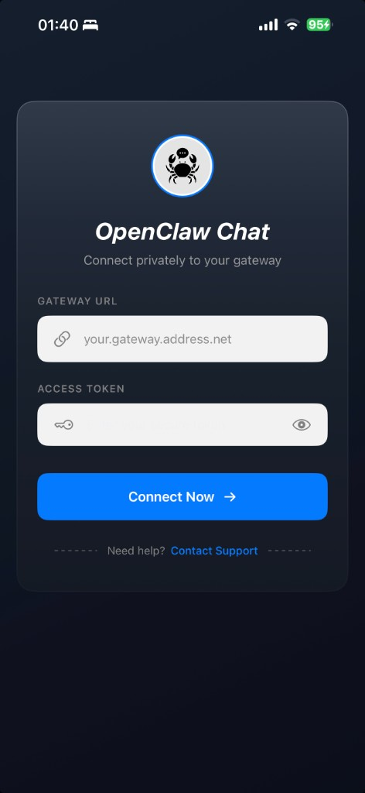
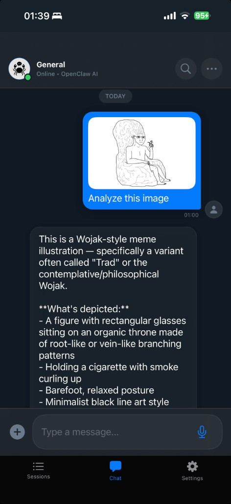
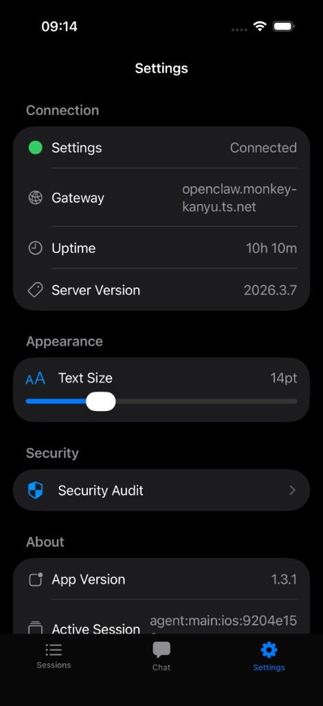

# OpenClaw Chat

A native iOS/iPadOS client for [OpenClaw](https://openclaw.io) — AI on your terms, running on your hardware.

**Your conversations never leave your control.** Unlike AI apps that route everything through third-party cloud services (ChatGPT, Claude.ai, Discord bots, WhatsApp integrations), OpenClaw Chat connects directly to your own self-hosted gateway. No middlemen, no data harvesting, no subscription lock-in.


## Screenshots

<p float="left">
  
  
  
</p>

## Features

- **Chat Interface** - Natural conversation with your AI assistant with real-time streaming responses
- **Voice Mode** - Hands-free voice-to-voice interaction. Speak your questions and hear responses read aloud
- **Multiple Sessions** - Organize conversations into separate sessions for different topics or projects
- **Security Audit** - Built-in security scanner to check your gateway configuration
- **Usage Tracking** - Monitor token usage and costs in real-time
- **Image & File Sharing** - Attach photos from your camera or library to send to the AI for analysis
- **Tailscale Integration** - Secure connectivity to your gateway over your Tailscale network

## Requirements

- iOS 17.0+ / iPadOS 17.0+
- An OpenClaw gateway instance running on your server
- Gateway access token for authentication
- Network connectivity to your gateway (direct, VPN, or Tailscale)

## Building

1. Clone the repository
2. Install [XcodeGen](https://github.com/yonaskolb/XcodeGen) if not already installed:
   ```bash
   brew install xcodegen
   ```
3. Generate the Xcode project:
   ```bash
   xcodegen generate
   ```
4. Open `ClawChat.xcodeproj` in Xcode
5. Build and run

## Configuration

### Initial Setup

1. Launch the app
2. Enter your OpenClaw gateway URL (e.g., `openclaw.your-tailnet.ts.net`)
3. Enter your gateway access token (found in `~/.openclaw/openclaw.json` → `gateway.auth.token`)
4. Tap Connect

### Device Pairing (First Connection Only)

OpenClaw requires device pairing for security. On first connection, the app will show "Waiting for approval..." while a pairing request is created on your gateway.

**To approve the device**, run this command on your gateway server:

```bash
# List pending pairing requests
openclaw devices list

# Approve the pending request
openclaw devices approve <requestId>
```

Once approved, the app will automatically connect. Future connections from the same device will work without re-approval.

**Auto-approval (optional):** To automatically approve devices that connect with a valid token, you can add a cron job on your gateway:

```bash
# Add to crontab -e
* * * * * /path/to/openclaw devices approve --latest 2>/dev/null
```

## Privacy

Every message goes directly from your phone to your gateway — nothing else. No analytics, no telemetry, no third-party SDKs phoning home. Your conversations, images, and voice recordings never touch any server you don't own.

This is the fundamental difference from apps like ChatGPT, Claude.ai, or AI bots on WhatsApp and Discord: with those, your data lives on someone else's infrastructure, subject to their terms, their retention policies, and their business model. With OpenClaw Chat, it's yours.

## License

MIT License - see [LICENSE](LICENSE) for details.

## Support

For issues and feature requests, please use [GitHub Issues](https://github.com/siimvene/Openclaw-Chat/issues).
